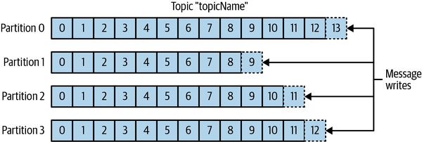
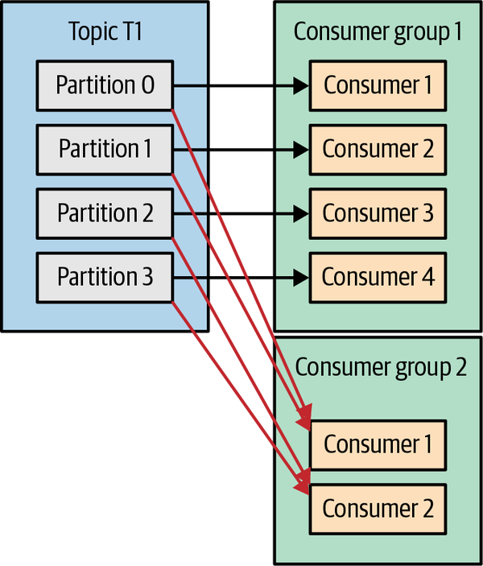

# Kafka Tutorial

- [Kafka Tutorial](#kafka-tutorial)
  - [Getting Started](#getting-started)
  - [Concepts](#concepts)
    - [Messages](#messages)
    - [Schemas](#schemas)
    - [Topics](#topics)
    - [Producer](#producer)
    - [Consumer](#consumer)
      - [Consumer Groups](#consumer-groups)
      - [Consumer behavior](#consumer-behavior)
      - [Commits and Offsets](#commits-and-offsets)
    - [Brokers](#brokers)
  - [Operations](#operations)
    - [Guarantees](#guarantees)
    - [Replication Factor](#replication-factor)
      - [Availability](#availability)
      - [Throughput](#throughput)
      - [Latency](#latency)
    - [Durability](#durability)
    - [Delivery Semantics](#delivery-semantics)
      - [Idempotent Producer](#idempotent-producer)
      - [Transactions](#transactions)
    - [Error Handling](#error-handling)
      - [Stop-on-error](#stop-on-error)
      - [Dead-letter queue](#dead-letter-queue)
      - [Retry Topics](#retry-topics)
      - [Order-preserving retries](#order-preserving-retries)
  - [References](#references)

Apache Kafka was developed as a publish/subscribe messaging system designed to solve this problem. It is often described as a “distributed commit log” or more recently as a “distributing streaming platform.” A filesystem or database commit log is designed to provide a durable record of all transactions so that they can be replayed to consistently build the state of a system. Similarly, data within Kafka is stored durably, in order, and can be read deterministically. In addition, the data can be distributed within the system to provide additional protections against failures, as well as significant opportunities for scaling performance.

## Getting Started

Clone the kafka repository

```bash
git clone git@github.com:apache/kafka.git
```
Fetch a release:

```bash
wget https://dlcdn.apache.org/kafka/3.1.0/kafka_2.12-3.1.0.tgz
tar -xvf kafka_2.12-3.1.0.tgz
cd kafka_2.12-3.1.0/bin
```

Start a local cluster:

```yaml
version: "3.3"

services:
  zookeeper:
    image: confluentinc/cp-zookeeper:latest
    environment:
      ZOOKEEPER_CLIENT_PORT: 2181
      ZOOKEEPER_TICK_TIME: 2000
    ports:
      - 2181:2181

  kafka:
    image: confluentinc/cp-kafka:latest
    depends_on:
      - zookeeper
    ports:
      - 29092:29092
      - 9092:9092
    environment:
      KAFKA_BROKER_ID: 1
      KAFKA_ZOOKEEPER_CONNECT: zookeeper:2181
      KAFKA_ADVERTISED_LISTENERS: PLAINTEXT://kafka:9092,PLAINTEXT_HOST://localhost:29092
      KAFKA_LISTENER_SECURITY_PROTOCOL_MAP: PLAINTEXT:PLAINTEXT,PLAINTEXT_HOST:PLAINTEXT
      KAFKA_INTER_BROKER_LISTENER_NAME: PLAINTEXT
      KAFKA_OFFSETS_TOPIC_REPLICATION_FACTOR: 1
```

```bash
docker-compose up
```

```bash
BROKER=127.0.0.1
TOPIC=test_lolololool
GROUP=$TOPIC
BOOTSTRAP=127.0.0.1:29092
```

## Concepts

### Messages

The unit of data within Kafka is called a message. A message can have an optional piece of metadata, which is referred to as a key. Both messages and keys are treated as byte arrays inside kafka.

Keys are used when messages are to be written to partitions in a more controlled manner. The simplest such scheme is to generate a consistent hash of the key and then select the partition number for that message by taking the result of the hash modulo the total number of partitions in the topic.

### Schemas

Kafka supports various serialization formats including JSON, XML, and Avro. By using well-defined schemas and storing them in a common repository, the messages in Kafka can be understood without coordination.

### Topics

Messages in Kafka are categorized into topics. The closest analogies for a topic are a database table or a folder in a filesystem. Topics are additionally broken down into a number of partitions. Messages are written to a partition an append-only fashion and are read in order from beginning to end. Note that as a topic typically has multiple partitions, there is no guarantee of message ordering across the entire topic, just within a single partition.



```bash
# Create a new topic
./kafka-topics.sh --create --topic $TOPIC --partitions 1 --replication-factor 1 --bootstrap-server $BOOTSTRAP
```

```bash
# See all topics
./kafka-topics.sh --bootstrap-server $BOOTSTRAP --list
```

### Producer

Producers create new messages. A message will be produced to a specific topic. By default, the producer will balance messages over all partitions of a topic evenly. In some cases, the producer will direct messages to specific partitions. This is typically done using the message key and a partitioner that will generate a hash of the key and map it to a specific partition. This ensures that all messages produced with a given key will get written to the same partition. The producer could also use a custom partitioner that follows other business rules for mapping messages to partitions.


```py
#!/usr/bin/env python3
# -*- coding: utf-8 -*-

from kafka import KafkaProducer
import json
import time
import argparse
import uuid
import random

parser = argparse.ArgumentParser(description='Kafka producer test')
parser.add_argument('-topic', type=str, help='Name of the topic', required=True)
parser.add_argument('-kafka_host', type=str, help='Kafka host', required=True)
parser.add_argument('-kafka_port', type=str, help='Kafka port', required=True)

args = parser.parse_args()
if args.topic is None or args.kafka_host is None or args.kafka_port is None:
  parser.print_help()


print(args)


class KafkaSink:

  def __init__(self, host, port):
    self.producer = KafkaProducer(
      bootstrap_servers=f'{host}:{port}',
      value_serializer=lambda v: json.dumps(v).encode('utf-8'),
      compression_type='gzip')

  def ingest(self, topic, data):
    for datum in data:
      self.producer.send(topic, datum)
    self.producer.flush()


k = KafkaSink(args.kafka_host, args.kafka_port)

for x in range(20):
  data = {
    "msg_id": str(uuid.uuid4()),
    "msg_type": "test",
    "source": "test_script",
  }
  k.ingest(args.topic, [data])
```

```bash
python3 ./test.py -topic $TOPIC -kafka_host $BROKER -kafka_port 9092
```

```bash
# Describe a topic
./kafka-topics.sh --bootstrap-server $BOOTSTRAP --topic $TOPIC --describe

# See total messages in a topic
./kafka-run-class.sh kafka.tools.GetOffsetShell --broker-list $BOOTSTRAP --topic $TOPIC | awk -F  ":" '{sum += $3} END {print sum}'
```

### Consumer

Consumers read messages. The consumer subscribes to one or more topics and reads the messages in the order in which they were produced to each partition. The consumer keeps track of which messages it has already consumed by keeping track of the offset of messages. The offset—an integer value that continually increases—is another piece of metadata that Kafka adds to each message as it is produced. Each message in a given partition has a unique offset, and the following message has a greater offset (though not necessarily monotonically greater). By storing the next possible offset for each partition, typically in Kafka itself, a consumer can stop and restart without losing its place.

```py
#!/usr/bin/env python3
# -*- coding: utf-8 -*-

from kafka import KafkaConsumer
import json
import time
import argparse
import uuid
import random

parser = argparse.ArgumentParser(description='Kafka consumer test')
parser.add_argument('-topic', type=str, help='Name of the topic', required=True)
parser.add_argument('-kafka_host', type=str, help='Kafka host', required=True)
parser.add_argument('-kafka_port', type=str, help='Kafka port', required=True)

args = parser.parse_args()
if args.topic is None or args.kafka_host is None or args.kafka_port is None:
  parser.print_help()


print(args)


class KafkaSource:

  def __init__(self, host, port):
    self.consumer = KafkaConsumer(
      topic=args.topic,
      enable_auto_commit=True,
      auto_offset_reset='earliest',  # 'latest',
      value_deserializer=lambda m: json.loads(m.decode("utf-8")),
      group_id=self.topic,
      bootstrap_servers=f'{host}:{port}')

  def ingest(self):
    for datum in self.source:
      print(f"Receiived {datum}, yay")


k = KafkaSource(args.kafka_host, args.kafka_port)
k.ingest()
```

#### Consumer Groups

Consumers work as part of a consumer group, which is one or more consumers that work together to consume a topic. The group ensures that each partition is only consumed by one member. In this way, consumers can horizontally scale to consume topics with a large number of messages. Additionally, if a single consumer fails, the remaining members of the group will reassign the partitions being consumed to take over for the missing member.


```bash
# see group offsets
./kafka-consumer-groups.sh --bootstrap-server $BOOTSTRAP --group $GROUP --describe --offsets
```

#### Consumer behavior

Consumers in a consumer group share ownership of the partitions in the topics they subscribe to. When we add a new consumer to the group, it starts consuming messages from partitions previously consumed by another consumer. The same thing happens when a consumer shuts down or crashes; it leaves the group, and the partitions it used to consume will be consumed by one of the remaining consumers. Reassignment of partitions to consumers also happens when the topics the consumer group is consuming are modified.

If the number of consumers in a group is less than the number of  partitions:


If the number of consumers in a group is equal to the number of  partitions:


If the number of consumers in a group is more than the number of  partitions:


Each consumer group gets to consume all messages:



Moving partition ownership from one consumer to another is called a rebalance. Rebalances are important because they provide the consumer group with high availability and scalability (allowing us to easily and safely add and remove consumers), but in the normal course of events they can be fairly undesirable.

#### Commits and Offsets

One of Kafka’s unique characteristics is that it allows consumers to use Kafka to track their position (offset) in each partition. We call the action of updating the current position in the partition an offset commit Consumers commit the last message they’ve successfully processed from a partition and implicitly assume that every message before the last was also successfully processed.

To maintain commit offsets, consumers send a message to Kafka, which updates a special `__consumer_offsets` topic with the committed offset for each partition. If a consumer crashes or a new consumer joins the consumer group, this will trigger a rebalance. After a rebalance, each consumer may be assigned a new set of partitions than the one it processed before. In order to know where to pick up the work, the consumer will read the latest committed offset of each partition and continue from there.

```bash
# reset or shift offsets
./kafka-consumer-groups.sh --bootstrap-server $BOOTSTRAP --group $TOPIC --reset-offsets --to-latest
./kafka-consumer-groups.sh --bootstrap-server $BOOTSTRAP --group $TOPIC --topic $TOPIC --execute --reset-offsets --to-earliest
./kafka-consumer-groups.sh --bootstrap-server $BOOTSTRAP --group $TOPIC --topic $TOPIC --execute --reset-offsets --to-latest
./kafka-consumer-groups.sh --bootstrap-server $BOOTSTRAP --group $TOPIC --topic $TOPIC --execute --reset-offsets --shift-by 60
```

### Brokers

A single Kafka server is called a broker. The broker receives messages from producers, assigns offsets to them, and writes the messages to storage on disk. It also services consumers, responding to fetch requests for partitions and responding with the messages that have been published. Depending on the specific hardware and its performance characteristics, a single broker can easily handle thousands of partitions and millions of messages per second.

Kafka brokers are designed to operate as part of a cluster. Within a cluster of brokers, one broker will also function as the cluster controller (elected automatically from the live members of the cluster). The controller is responsible for administrative operations, including assigning partitions to brokers and monitoring for broker failures. A partition is owned by a single broker in the cluster, and that broker is called the leader of the partition. A replicated partition is assigned to additional brokers, called followers of the partition. Replication provides redundancy of messages in the partition, such that one of the followers can take over leadership if there is a broker failure. All producers must connect to the leader in order to publish messages, but consumers may fetch from either the leader or one of the followers. Cluster operations, including partition replication


## Operations

### Guarantees

1. Kafka provides order guarantee of messages in a partition.
2. Produced messages are considered “committed” when they were written to the partition on all its in-sync replicas (but not necessarily flushed to disk).
3. Messages that are committed will not be lost as long as at least one replica remains alive.
4. Consumers can only read messages that are committed.

### Replication Factor

A replication factor of N allows us to lose N-1 brokers while still being able to read and write data to the topic. So a higher replication factor leads to higher availability, higher reliability, and fewer disasters. On the flip side, for a replication factor of N, we will need at least N brokers and we will store N copies of the data, meaning we will need N times as much disk space. We are basically trading availability for hardware.

#### Availability

Each replica is a copy of all the data in a partition. If a partition has a single replica and the disk becomes unusable for any reason, we’ve lost all the data in the partition.

#### Throughput

With each additional replica, we multiply the inter-broker traffic.

#### Latency

Each produced record has to be replicated to all in-sync replicas before it is available for consumers. With more replicas, there is higher probability that one of these replicas is a bit slow and therefore will slow the consumers down.

### Durability

Kafka will acknowledge messages that were not persisted to disk, depending just on the number of replicas that received the message. Kafka will flush messages to disk when rotating segments (by default 1 GB in size) and before restarts but will otherwise rely on Linux page cache to flush messages when it becomes full.

### Delivery Semantics

Kafka supports exactly-once delivery semantics. Exactly-once semantics in Kafka is a combination of two key features: idempotent producers, which help avoid duplicates caused by producer retries, and transactional semantics, which guarantee exactly-once processing in stream processing applications.

#### Idempotent Producer

When idempotent producers are enabled, each message will include a unique identified producer ID (PID) and a sequence number. These, together with the target topic and partition, uniquely identify each message. Brokers use these unique identifiers to track the last five messages produced to every partition on the broker. To limit the number of previous sequence numbers that have to be tracked for each partition, we also require that the producers will use `max.inflight.requests=5` or lower (the default is 5). When a broker receives a message that it already accepted before, it will reject the duplicate with an appropriate error.

#### Transactions

Kafka transactions introduce the idea of atomic multipartition writes. The idea is that committing offsets and producing results both involve writing messages to partitions. However, the results are written to an output topic, and offsets are written to the `_consumer_offsets` topic. If we can open a transaction, write both messages, and commit if both were written successfully—or abort to retry if they were not — we get  exactly-once semantics. We control the consumption of messages that were written transactionally by setting the `isolation.level` configuration.


### Error Handling

#### Stop-on-error

There are cases when all input events must be processed in order without exceptions. An example is handling the change-data-capture stream from a database.


#### Dead-letter queue

This is a common scenario where events that cannot be processed by the application are routed to an error topic while the main stream continues.


#### Retry Topics

Adding a retry topic provides the ability to process most events right away while delaying the processing of other events until the required conditions are met. In the example, you would route events to the retry topic if the price of the item is not available at the time. This recoverable condition should not be treated as an error but periodically retried until the conditions are met.


#### Order-preserving retries

In this pattern, the main application needs to keep track of every event routed to the retry topic. When a dependent condition is not met (for instance, the price of an item) the main application stores a unique identifier for the event in a local in-memory structure. The unique event identifiers are grouped by the item that they belong to. This helps the application determine if events related to a particular item, for example, Item A, are currently being retried and therefore subsequent events related to Item A should be sent to the retry path to preserve order.


## References

Textbooks:
1. [Kafka: The Definitive Guide](https://learning.oreilly.com/library/view/kafka-the-definitive/9781492043072/)
2. [Kafka in Action](https://learning.oreilly.com/library/view/kafka-in-action/9781617295232/)
3. [Error handling](https://www.confluent.io/blog/error-handling-patterns-in-kafka/)
4. [Confluent docs](https://docs.confluent.io/platform/current/kafka/kafka-basics.html)
5. [Official docs](https://kafka.apache.org/20/documentation.html)
6. [Source](https://github.com/apache/kafka)
